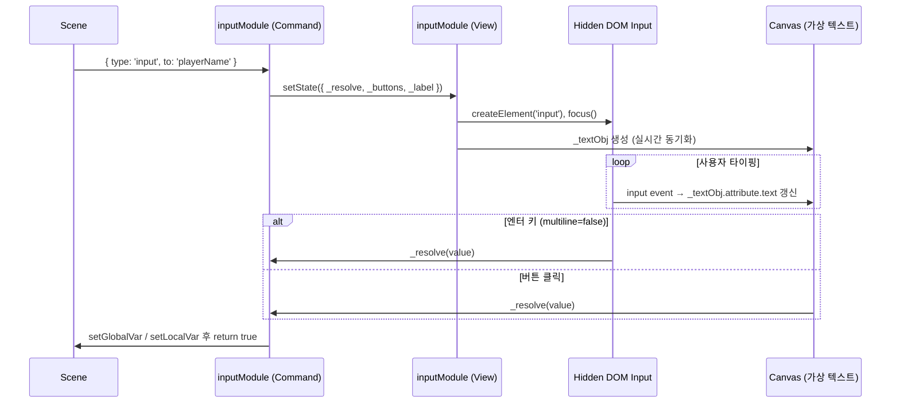

# 📝 Input Module

> **대상**: 씬 개발자\
> **성격**: How-to + Reference

---

## 개요 (Overview)

`inputModule`은 사용자로부터 텍스트를 입력받아 전역/지역 변수에 저장하는 커맨드
모듈입니다. 보이지 않는 `<input>` 또는 `<textarea>`를 DOM에 생성하여 실제 키
입력을 수집하고, 캔버스 위에 **가상 텍스트 오브젝트**를 실시간으로 렌더링합니다.

---

## 사전 준비 (Prerequisites)

`inputModule`은 **내장 모듈**이므로 별도 등록 없이 `defineNovelConfig`만으로
사용 가능합니다.

```ts
import { defineNovelConfig } from "fumika";

export default defineNovelConfig({
  variables: { playerName: "" },
  scenes: ["intro"],
  characters: {},
  backgrounds: {},
});
```

---

## 핵심 예제 (Main Example)

### 단일 줄 입력 (엔터로 완료)

```ts
{ type: 'input', to: 'playerName', label: '당신의 이름을 입력하세요' }
```

### 여러 줄 입력 + 완료/취소 버튼

```ts
{
  type: 'input',
  to: 'memo',
  multiline: true,
  label: '메모를 입력하세요',
  buttons: [
    { text: '저장' },                    // 입력 내용을 'memo' 변수에 저장하고 종료
    { text: '취소', cancel: true },      // 저장 없이 종료
  ],
}
```

### defineInitial로 씬 전체 스타일 지정

```ts
defineScene({ config, initial: { "input": { panel: { minWidth: 560 } } } }, [
  { type: "input", to: "playerName", label: "이름을 입력하세요" },
]);
```

---

## 커맨드 속성 (InputCmd)

| 속성        | 타입            | 필수 | 설명                                           |
| :---------- | :-------------- | :--: | :--------------------------------------------- |
| `type`      | `'input'`       |  ✅  | 커맨드 타입                                    |
| `to`        | `string`        |  ✅  | 결과를 저장할 변수명. `_`로 시작하면 지역 변수 |
| `label`     | `string`        |  -   | 입력창 상단 안내 텍스트                        |
| `multiline` | `boolean`       |  -   | `true`이면 여러 줄 입력 가능. 기본값 `false`   |
| `buttons`   | `InputButton[]` |  -   | 완료 버튼 목록. 생략 시 `[{ text: '확인' }]`   |
| `layout`    | `InputLayout`   |  -   | 이 커맨드에만 적용할 레이아웃 오버라이드       |

---

## 버튼 설정 (InputButton)

| 속성             | 타입             | 설명                                                                       |
| :--------------- | :--------------- | :------------------------------------------------------------------------- |
| `text`           | `string`         | 버튼 레이블                                                                |
| `cancel`         | `boolean`        | `true`이면 취소 버튼. 클릭 시 입력 내용을 변수에 저장하지 않고 커맨드 종료 |
| `style`          | `Partial<Style>` | 버튼 배경 스타일 오버라이드                                                |
| `hoverStyle`     | `Partial<Style>` | 버튼 배경 호버 스타일                                                      |
| `textStyle`      | `Partial<Style>` | 버튼 텍스트 스타일                                                         |
| `textHoverStyle` | `Partial<Style>` | 버튼 텍스트 호버 스타일                                                    |

버튼 클릭 시 입력된 텍스트가 `to` 변수에 저장되고 커맨드가 종료됩니다.

---

## 레이아웃 (InputLayout)

| 속성             | 타입     | 기본값 | 설명                              |
| :--------------- | :------- | :----: | :-------------------------------- |
| `paddingX`       | `number` |  `32`  | 패널 좌우 패딩 (px)               |
| `paddingY`       | `number` |  `24`  | 패널 상하 패딩 (px)               |
| `labelInputGap`  | `number` |  `12`  | 레이블과 입력 영역 사이 간격 (px) |
| `inputButtonGap` | `number` |  `20`  | 입력 영역과 버튼 사이 간격 (px)   |
| `buttonGap`      | `number` |  `8`   | 버튼 간 가로 간격 (px)            |
| `buttonPaddingX` | `number` |  `40`  | 버튼 내부 좌우 패딩 합산 (px)     |
| `buttonPaddingY` | `number` |  `16`  | 버튼 내부 상하 패딩 합산 (px)     |

---

## 스키마 스타일 (InputSchema)

`defineInitial`로 씬 전체에 적용할 스타일을 지정합니다.

| 필드              | 타입                                        | 설명                           |
| :---------------- | :------------------------------------------ | :----------------------------- |
| `overlay`         | `Partial<Style>`                            | 전체 화면 오버레이 배경 스타일 |
| `panel`           | `Partial<Style> & { minWidth?, maxWidth? }` | 입력 패널 스타일               |
| `labelStyle`      | `Partial<Style>`                            | 레이블 텍스트 스타일           |
| `inputTextStyle`  | `Partial<Style>`                            | 가상 입력 텍스트 스타일        |
| `cursorStyle`     | `Partial<Style>`                            | 커서(`\|`) 스타일              |
| `button`          | `Partial<Style>`                            | 버튼 기본 스타일               |
| `buttonHover`     | `Partial<Style>`                            | 버튼 호버 스타일               |
| `buttonText`      | `Partial<Style>`                            | 버튼 텍스트 스타일             |
| `buttonTextHover` | `Partial<Style>`                            | 버튼 텍스트 호버 스타일        |
| `layout`          | `InputLayout`                               | 레이아웃 기본값                |

---

## 동작 원리 (Explanation)



### 포커스 유지 메커니즘

- 모듈이 활성화되는 동안 **300ms 주기**로 `_hiddenEl.focus()`를 재호출합니다.
- 사용자가 시각적 입력 영역(캔버스의 inputBgObj)을 **클릭**하면 즉시 포커스가
  복귀됩니다.
- [VirtualKeyboard API](https://developer.mozilla.org/en-US/docs/Web/API/VirtualKeyboard_API)를
  지원하는 환경에서는 `overlaysContent = true`로 설정되어 소프트 키보드가
  캔버스를 가리지 않습니다.

### 커서 깜박임

- 500ms 주기로 `|` 커서 오브젝트의 `opacity`를 토글합니다.
- 커맨드 종료 또는 씬 전환 시 `clearInterval`로 자동 해제됩니다.

---

## 훅 (InputHook)

| 키             | 인자 타입              | 설명                                              |
| :------------- | :--------------------- | :------------------------------------------------ |
| `input:open`   | `{ label, multiline }` | 입력창이 열릴 때 방출. 레이블/모드 변환 가능      |
| `input:submit` | `{ varName, text }`    | 입력 완료 시 방출. 저장될 변수명·텍스트 변환 가능 |

```ts
defineHook(config, {
  "input:submit": {
    onBefore: ({ varName, text }) => ({ varName, text: text.trim() }),
  },
});
```

---

## 주의 사항 (Edge Cases)

- **`multiline=false`** 일 때 엔터 키는 **첫 번째 버튼**과 동일하게 처리됩니다.
  `textarea` 모드에서는 줄바꿈으로 처리됩니다.
- `buttons`를 빈 배열(`[]`)로 설정하면 버튼이 표시되지 않습니다. 이 경우
  `multiline=false`의 엔터 키만이 완료 수단입니다.
- `to` 변수가 전역 vars 타입에 선언되어 있지 않아도 런타임에 저장은 되지만,
  **TypeScript 타입 추론은 적용되지 않습니다**.
- 씬 전환 시 `onCleanup`이 호출되며 DOM 요소가 자동으로 제거됩니다. 수동 제거는
  불필요합니다.
