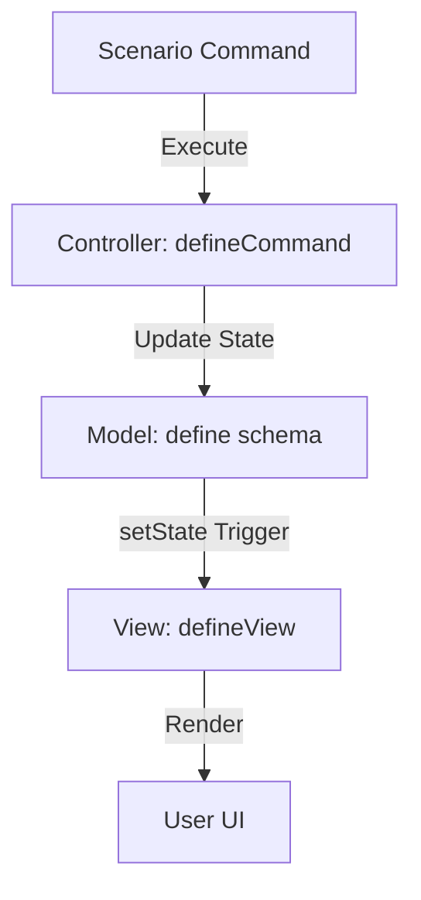

# 🧩 Custom Module Guide

`kotonoha`은 모든 기능을 독립적인 모듈 단위로 관리합니다. 이 가이드는 엔진의 핵심
클래스(`Novel`, `Renderer`, `SceneContext`)와 모듈이 상호작용하는 기술적 원리와
구현 방법을 상세히 설명합니다.

---

## 🏗️ 아키텍처 및 데이터 흐름

엔진의 모듈이 **MVC 아키텍처**를 따르는 이유는 **데이터와 연출의 완전한
분리(Decoupling)**를 위해서입니다.



- **Model을 쓰는 이유**: 데이터를 직접 조작하는 대신 반응형 상태를 관리함으로써,
  여러 커맨드가 동시에 데이터를 바꿔도 UI는 항상 최종 상태를 안전하게
  반영합니다.
- **Controller를 쓰는 이유**: 복잡한 로직(시간 대기, 조건 검사 등)을 시나리오
  바깥으로 격리하여 시나리오 코드를 간결하게 유지합니다.
- **View를 쓰는 이유**: 실제 렌더링 기술(DOM, Canvas 등)에 관계없이 엔진 코어는
  `update` 함수만 호출하면 되도록 추상화하기 위함입니다.

---

## 💎 모듈 제작 프로세스 요약

| 단계             | 작업 내용                          | 사용 함수         |
| :--------------- | :--------------------------------- | :---------------- |
| **1. 상태 정의** | 모듈이 관리할 데이터 구조 설계     | `define(schema)`  |
| **2. 로직 구현** | 시나리오 명령 실행 시의 동작 구현  | `defineCommand()` |
| **3. UI 구현**   | 데이터를 화면에 그리는 렌더러 구현 | `defineView()`    |

---

## 🔄 상세 구현 명세

### 1. 상태 정의 (Model)

`define(schema)`를 통해 생성된 `state`는 모듈의 상태 구조를 나타냅니다. 상태
변경은 **`setState`** 함수를 통해 이루어집니다.

- **Scheme 조작**: 핸들러 내부에서 `setState({ prop: value })`와 같이 호출하여
  모듈의 **스키마(Scheme) 데이터를 안전하게 변경**합니다. 상태를 직접
  변경(mutate)하지 마십시오.
  ```ts
  // ❌ 잘못된 예시
  module.defineCommand(function* (cmd, ctx, state, setState) {
    state.opacity = 0; // X
    state.text = "Hello"; // X
  });

  // ✅ 올바른 예시
  module.defineCommand(function* (cmd, ctx, state, setState) {
    setState({ opacity: 0, text: "Hello" }); // O
  });
  ```
- **Update 호출**: `setState`를 통해 상태가 변경되면 엔진이 이를 감지하며,
  결과적으로 `defineView`에서 정의한 **`update(data)` 함수가 자동으로 호출**되어
  화면이 갱신됩니다. 여러 `setState` 호출은 렌더링 최적화를 위해 동기적으로 일괄
  처리(batch)됩니다.
- **Initial Override**: 여기에 정의된 기본값은
  [Scene의 `initial`](./scenes.md#2-초기-상태-설정-initial) 속성에 의해 씬별로
  오버라이드될 수 있습니다.

---

### 2. 커맨드 핸들러 (Controller)

시나리오의 명령을 실행하는 핵심 로직이며, 제너레이터(`function*`)로 구현됩니다.

#### 💡 인자 상세 명세

| 인자명         | 역할                | 도입 이유 (Why)                                                                                                                                                   |
| :------------- | :------------------ | :---------------------------------------------------------------------------------------------------------------------------------------------------------------- |
| **`cmd`**      | **입력 데이터**     | 엔진이 **Resolvable 함수를 미리 실행(Resolved)**하여 최종 값으로 변환한 데이터입니다. 개발자는 별도의 타입 체크나 호출 없이 즉시 데이터를 사용할 수 있습니다.     |
| **`ctx`**      | **엔진 인터페이스** | 렌더러(`ctx.renderer`), 월드(`ctx.world`), 씬 제어(`ctx.scene`), 타 모듈 UI 접근(`ctx.ui`) 등 엔진의 모든 자원에 접근하기 위한 **통합 게이트웨이**입니다.         |
| **`state`**    | **내부 상태**       | 모듈의 현재 상태 객체입니다. (읽기 전용)                                                                                                                          |
| **`setState`** | **상태 변경 함수**  | `setState(newState)` 형태로 호출하여 모듈의 상태를 갱신합니다. 부분 업데이트(Partial Update)를 지원하며, 이 함수를 통해 상태를 변경해야 UI가 올바르게 갱신됩니다. |

#### 💡 실행 흐름 제어 (Yield & Return)

엔진은 핸들러가 종료될 때까지 반복적으로 `.next()`를 호출하며 실행 흐름을
제어합니다.

| 반환값            | 엔진의 동작                 | 주요 용도                                                                                                   |
| :---------------- | :-------------------------- | :---------------------------------------------------------------------------------------------------------- |
| **`yield false`** | **실행 일시 중단 (Wait)**   | 사용자 입력(클릭/엔터) 대기, 애니메이션 완료 대기. `ctx.callbacks.advance()`를 호출하여 재개할 수 있습니다. |
| **`return true`** | **현재 커맨드 종료 (Done)** | 다음 시나리오 커맨드로 자동 진행                                                                            |

---

### 3. UI 렌더러 (View)

`defineView`는 `UIRuntimeEntry` 객체를 반환하며, 이는 `Novel` 인스턴스에 의해
일괄 관리됩니다.

| 메서드          | 엔진 연동 원리                    | 도입 이유 (Why)                                                    |
| :-------------- | :-------------------------------- | :----------------------------------------------------------------- |
| **`show`**      | **`novel.showUI()`** 호출 시 실행 | **'인터페이스 숨기기'** 해제 시 UI를 다시 화면에 나타냄            |
| **`hide`**      | **`novel.hideUI()`** 호출 시 실행 | 우클릭 등을 통한 **'UI 숨기기'** 모드 진입 시 UI를 일시적으로 감춤 |
| **`onUpdate`**  | **`state`** 변경 시 자동 호출     | 데이터 변화에 따른 실시간 화면 갱신                                |
| **`onCleanup`** | **씬/상태 전환 시** 자동 호출     | 완전한 리소스 해제(DOM 제거, 이벤트 리스너 해제 등)                |

#### 💡 역할 기반 UI 제어 (Role-based UI Control)

엔진 코어가 특정 모듈 이름에 직접 의존하지 않도록, View는 반환 시 자신의 역할과
입력 처리 방식을 선언해야 합니다.

| 선언 속성        | 타입            | 역할 및 동작 원리                                                                                                                            |
| :--------------- | :-------------- | :------------------------------------------------------------------------------------------------------------------------------------------- |
| **`uiGroup`**    | `string`        | 이 UI의 소속 그룹. (예: `'dialogue'`)                                                                                                        |
| **`hideGroups`** | `string[]`      | 현재 실행 중인 커맨드의 `type`과 모듈의 등록 키가 일치할 때, 자동으로 숨겨야 할 그룹 목록. 엔진이 대상 그룹 UI의 `hide()`를 자동 호출합니다. |
| **`canAdvance`** | `() => boolean` | `novel.next()` 호출 시 동적으로 판단하여 진행을 막을 수 있습니다. 타이핑 등 연출 중에 유용합니다.                                            |

---

### 4. 렌더러 연동 및 자원 관리 (`Renderer`)

핸들러 내부에서 `ctx.renderer`를 통해 실제 캔버스 연출을 수행할 때의 규칙입니다.

- **객체 추적 (`track`)**: 캔버스에 생성한 모든 오브젝트는
  `ctx.renderer.track(obj)`를 통해 등록해야 합니다. 엔진은 씬이 전환될 때 추적된
  모든 객체를 일괄 삭제하여 메모리 누수를 방지합니다.
- **애니메이션 (`animate`)**: `ctx.renderer.animate()` 유틸리티를 사용하십시오.
  이는 엔진의 **Skip 모드**와 연동되어, 사용자가 빠른 감기 중일 때는 애니메이션
  소요 시간을 자동으로 0으로 처리합니다.
- **시간 보정 (`dur`)**: 모든 수치 형태의 시간값은 `ctx.renderer.dur(1000)`과
  같이 감싸서 사용하십시오. 글로벌 스킵 상태에 따른 시간 보정이 자동으로
  적용됩니다.
