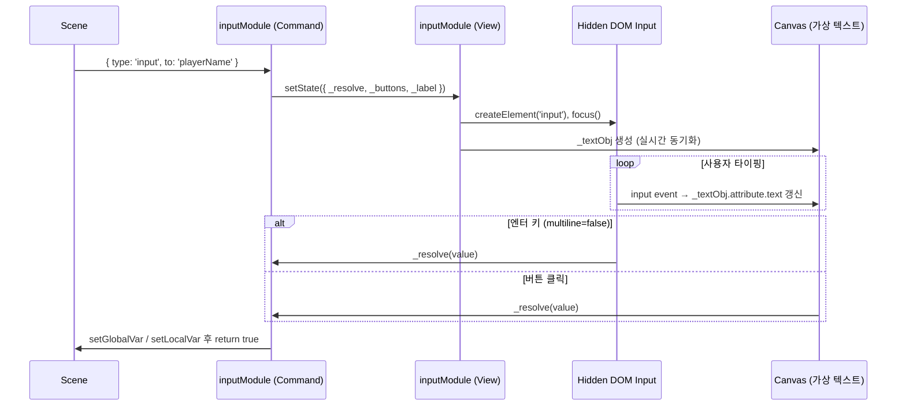

# ⌨️ Input Module

---

## 1. 개요 (Overview)

`input` 모듈은 사용자로부터 직접 텍스트 입력을 받아 전역 또는 지역 변수에 저장하는 기능을 제공합니다. 플레이어의 이름을 결정하거나, 암호를 입력받는 등의 상호작용에 필수적인 모듈입니다.

### 주요 특징
*   **변수 자동 저장**: 입력된 값을 지정된 변수(`to`)에 자동으로 할당합니다. 접두사 규칙(`_`)에 따라 전역/지역 스코프가 결정됩니다.
*   **멀티라인 지원**: 단일 줄 입력뿐만 아니라 긴 문장을 입력받을 수 있는 여러 줄(textarea) 모드를 지원합니다.
*   **커스텀 버튼**: 확인, 취소 등 여러 개의 버튼을 구성할 수 있으며 각 버튼에 고유한 기능을 부여할 수 있습니다.
*   **보안 및 포커스**: 전체화면이나 모바일 환경에서도 입력 포커스가 유지되도록 설계되었습니다.

---

## 2. 핵심 예제 (Main Example)

### 이름 입력 및 메모 작성

```ts
[
  // 1. 단순 이름 입력 (엔터 키로 완료 가능)
  { 
    type: 'input', 
    to: 'playerName', 
    label: '당신의 이름을 알려주세요.' 
  },

  // 2. 여러 줄 메모 입력 및 취소 버튼 구성
  {
    type: 'input',
    to: '_currentMemo', // 지역 변수에 저장
    label: '오늘의 일기를 작성하세요.',
    multiline: true,
    buttons: [
      { text: '저장하기' },
      { text: '작성 취소', cancel: true } // 변수에 저장하지 않고 종료
    ]
  }
]
```

---

## 3. 커맨드 상세 (Command Reference)

### Input 명령 (`InputCmd`)

| 속성 | 타입 | 필수 | 설명 |
| :--- | :--- | :---: | :--- |
| `type` | `'input'` | ✅ | 입력 커맨드임을 명시합니다. |
| `to` | `string` | ✅ | 입력값을 저장할 변수 이름입니다. `_`로 시작하면 지역 변수에 저장됩니다. |
| `label` | `string` | - | 입력창 상단에 표시될 안내 문구입니다. |
| `multiline` | `boolean` | - | `true`이면 여러 줄 입력 모드로 작동합니다. (기본값: `false`) |
| `buttons` | `InputButton[]` | - | 하단에 표시될 버튼 목록입니다. 생략 시 `[{ text: '확인' }]`이 표시됩니다. |

#### InputButton 객체

| 속성 | 타입 | 필수 | 설명 |
| :--- | :--- | :---: | :--- |
| `text` | `string` | ✅ | 버튼에 표시될 텍스트입니다. |
| `cancel` | `boolean` | - | `true`이면 취소 버튼으로 동작하며, 변수에 값을 저장하지 않습니다. |
| `style` | `Style` | - | 버튼 배경의 커스텀 스타일입니다. |
| `textStyle` | `Style` | - | 버튼 텍스트의 커스텀 스타일입니다. |

---

## 4. 훅 (Hooks)

입력이 시작되거나 제출되는 시점에 필터링이나 유효성 검사를 수행할 수 있습니다.

* [상세 가이드: Input Hooks (입력 훅)](./hooks/input.md)

---

## 5. 상태 및 레이아웃 (State & Layout)

입력 패널의 디자인과 커서, 오버레이 등의 스타일을 조정할 수 있습니다.

* [상세 가이드: Input 상태 및 레이아웃](./state/input.md)

---

## 6. 동작 원리 (Technical Implementation)

### 시퀀스 다이어그램



### 포커스 유지 및 커서 메커니즘

*   **포커스 유지**: 입력창이 활성화되는 동안 엔진은 자동으로 숨겨진 `<input>` 요소에 포커스를 맞춥니다. 사용자가 다른 곳을 클릭하더라도 300ms 주력이 포커스를 복귀시켜 끊김 없는 입력을 보장합니다.
*   **커서 깜빡임**: 500ms 주기로 `|` 커서 오브젝트의 불투명도를 토글하여 입력 중임을 시각적으로 알립니다.
*   **가상 텍스트**: 실제 입력은 보이지 않는 DOM 요소에서 처리되지만, 캔버스 위에는 엔진의 텍스트 오브젝트가 실시간으로 동기화되어 렌더링됩니다.

---

## 7. 주의 사항 (Edge Cases)

*   **포커스 관리**: 입력창이 활성화되면 엔진은 자동으로 해당 입력 영역에 포커스를 맞춥니다. 사용자가 다른 곳을 클릭해도 자동으로 포커스가 복귀됩니다.
*   **엔터 키 동작**: `multiline: false`인 경우 엔터 키를 누르면 첫 번째 버튼(인덱스 0)을 클릭한 것과 동일하게 작동합니다.
*   **취소(Cancel)**: `cancel: true`인 버튼을 클릭하면 `input:submit` 훅은 발생하지만, 최종적으로 변수(`to`)에는 아무런 값도 저장되지 않습니다.
