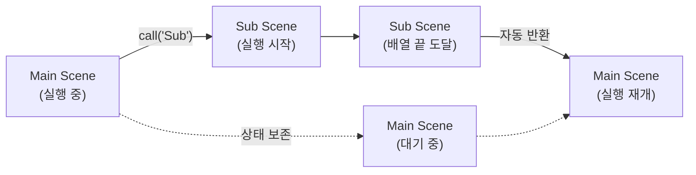
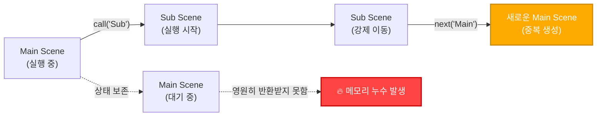

# 📖 Fumika 엔진 활용 가이드: 기초부터 실전까지

본 가이드는 `fumika` 엔진을 사용하여 고성능 웹 기반 비주얼 노벨을 제작하려는 개발자분들을 위해 작성되었습니다.  
엔진의 핵심 설계 철학과 실무 적용 방법을 단계별로 상세히 안내해 드립니다.  

---

## 📑 학습 목차 (Tutorial Index)

| 단계 | 제목 | 주요 학습 및 기술적 포인트 |
| :--- | :--- | :--- |
| **[Step 01](#step-01)** | [환경 구축 및 설치](#step-01) | 개발 환경 설정 및 패키지 설치 절차 |
| **[Step 02](#step-02)** | [프로젝트 구성 및 설정](#step-02) | `novel.config.ts`를 통한 중앙 집중식 관리 |
| **[Step 03](#step-03)** | [캐릭터 및 리소스 정의](#step-03) | 레이어드 시스템의 구조와 자원 최적화 |
| **[Step 04](#step-04)** | [엔진 구동 및 라이프사이클](#step-04) | 초기 로딩부터 시나리오 실행까지의 단계 |
| **[Step 05](#step-05)** | [사용자 상호작용 및 변수](#step-05) | 상태 관리 시스템과 데이터 영속성 구현 |
| **[Step 06](#step-06)** | [고급 연출 및 시각 효과](#step-06) | 카메라 제어 및 병렬 실행 최적화 기법 |
| **[Step 07](#step-07)** | [중첩 씬과 서브 시스템](#step-07) | 콜 스택 구조를 활용한 고급 아키텍처 설계 |

---

## <a id="step-01"></a>01. 환경 구축 및 설치 (Installation) 🛠️

`fumika` 엔진은 최신 웹 표준과 TypeScript의 강력한 타입 시스템을 기반으로 설계되었습니다.  
안정적이고 효율적인 개발을 위해 적절한 환경을 구축하는 것이 권장됩니다.  

### **프로젝트 초기화 및 엔진 설치**
```bash
# 프로젝트 디렉토리 생성 및 이동
mkdir my-novel-project && cd my-novel-project

# 패키지 매니저 초기화 및 엔진 라이브러리 설치
npm init -y
npm install fumika
```

`fumika`는 대규모 시나리오 작업 시 발생할 수 있는 참조 오류를 방지하기 위해 엄격한 타입 체크를 지원합니다.  
VS Code와 같은 최신 IDE를 활용하시면 엔진이 제공하는 자동 완성 기능을 통해 더욱 정교한 코딩이 가능합니다.  

---

## <a id="step-02"></a>02. 프로젝트 구성 및 설정 (Configuration) ⚙️

모든 `fumika` 프로젝트는 `novel.config.ts`라는 중앙 설정 파일을 통해 모든 시각적 요소와 시스템 동작을 제어합니다.  

### **설정 파일 구성 예시**
```ts
import { defineNovelConfig } from 'fumika'

export default defineNovelConfig({
  width: 1280,
  height: 720,
  // 전역적으로 보존되어야 하는 게임 상태 정의
  variables: { 
    gold: 100,
    playerName: '여행자'
  },
  // 에셋 식별자와 경로의 매핑 관리
  assets: {
    bg_room: './assets/room.webp',
    aris_body: './assets/aris_body.png',
  }
})
```

에셋 경로를 직접 명시하지 않고 ID 기반으로 관리함으로써, 파일 구조 변경 시에도 유연하게 대응할 수 있는 아키텍처를 확보하게 됩니다.  

---

## <a id="step-03"></a>03. 캐릭터 및 리소스 정의 (Assets) 🎭

`fumika` 엔진은 브라우저의 한정된 자원을 극대화하기 위해 **레이어드 캐릭터 시스템(Layered Character System)**을 채택하고 있습니다.  

### **레이어 기반의 효율적 구조**
캐릭터의 공통 몸체(`base`)를 공유하고 감정 표현(`emotion`) 레이어만 동적으로 교체함으로써, 메모리 점유율을 획기적으로 낮추고 렌더링 성능을 확보할 수 있습니다.  

```ts
characters: {
  aris: {
    name: '아리스',
    bases: {
      default: { 
        src: 'aris_body', 
        width: 600,
        // 시점 제어를 위한 앵커 포인트(Anchor Point) 정의
        points: { face: { x: 0.5, y: 0.25 } }
      }
    },
    emotions: {
      happy: { face: 'aris_face_happy' },
      sad: { face: 'aris_face_sad' }
    }
  }
}
```

---

## <a id="step-04"></a>04. 엔진 구동 및 라이프사이클 (Lifecycle) 🚀

엔진의 구동 과정은 리소스 준비, 시스템 모듈 부팅, 시나리오 실행의 세 가지 주요 단계를 거치게 됩니다.  

### **구동 프로세스 구현 상세**
```ts
const novel = new Novel(config, {
  element: document.getElementById('app'),
  scenes: { 'intro': introScene }
})

// 엔진의 라이프사이클을 순차적으로 제어합니다.  
await novel.load(); // 비동기 에셋 프리로딩을 완수합니다.  
await novel.boot(); // 시스템 모듈 및 렌더링 파이프라인을 초기화합니다.  
novel.start('intro'); // 시나리오의 첫 번째 명령어를 실행합니다.  
```

`load()` 단계를 통해 필수 리소스를 사전에 확보함으로써, 장면 전환 중의 시각적 끊김을 방지하고 부드러운 플레이 환경을 제공합니다.  

---

## <a id="step-05"></a>05. 사용자 상호작용 및 변수 관리 (Interaction) 🤝

플레이어의 선택은 이야기의 흐름을 결정짓는 동시에 데이터의 **영속성(Persistence)** 관리와 직결됩니다.  

### **스코프 기반의 변수 시스템**
`fumika` 엔진은 완벽한 세이브/로드 기능을 위해 모든 내부 상태를 직렬화하여 저장합니다.  
개발자는 두 가지 스코프의 변수를 활용하여 시나리오 로직을 설계할 수 있습니다.  

*   **전역 변수 (Global Variables)**: 프로젝트 전체에서 공유되며, 씬 전환 후에도 상태를 유지합니다.  
*   **지역 변수 (Local Variables)**: 특정 씬 내부에서만 유효하며, 씬 종료 시 자동으로 소거됩니다.  

전역 변수와 활성화된 지역 변수, 그리고 모든 모듈의 내부 상태 데이터는 `novel.save()` 호출 시 자동으로 보존되어 로드 시 완벽히 복원됩니다.  

---

## <a id="step-06"></a>06. 고급 연출 및 시각 효과 (Visual Effects) 🎬

역동적인 비주얼 노벨 연출을 위해서는 순차적 실행과 병렬 처리를 전략적으로 조합해야 합니다.  

### **병렬 실행 기법의 활용**
`skip: true` 속성을 활용하면 해당 연출의 완료를 기다리지 않고 후속 커맨드를 즉시 실행하여, 복합적이고 화려한 장면을 구성할 수 있습니다.  

```ts
// 배경 전환과 대사 출력을 동시에 진행하는 예시입니다.  
{ type: 'background', name: 'sunset', skip: true },
{ type: 'dialogue', text: '어느덧 붉은 노을이 수평선 너머로 드리우기 시작했습니다.' },

// 캐릭터의 얼굴 부위로 시점을 부드럽게 집중시킵니다.  
{ type: 'character-focus', name: 'aris', point: 'face', duration: 1500 }
```

---

## <a id="step-07"></a>07. 중첩 씬과 서브 시스템 아키텍처 (Advanced) 🪆

중첩 씬(Nested Scenes)은 현재 진행 중인 씬을 잠시 멈추고 다른 씬을 실행한 뒤, 완료되면 다시 원래 위치로 돌아오는 고급 기능입니다. 프로그래밍의 **서브루틴(함수 호출)** 개념과 완전히 동일합니다.

전화 수신 연출, 일시적인 조사 이벤트, 미니 게임 등 일회성 서브 시스템을 구현할 때 매우 유용합니다.

### 1. 중첩 씬 호출 (`call` 예약어)

중첩 씬은 `defineScene` 콜백에서 제공되는 `call` 예약어를 통해 호출할 수 있습니다. 

| 속성 | 타입 | 기본값 | 설명 |
| :--- | :--- | :--- | :--- |
| `preserve` | `boolean` | `false` | `true`일 경우, 진입 시 기존 씬에 그려진 렌더링 상태(캐릭터, 배경 등)를 지우지 않고 그대로 유지합니다. |
| `restore` | `boolean` | `false` | `true`일 경우, 서브 씬이 종료되고 돌아올 때 호출 이전의 렌더링 및 사운드 상태를 완벽히 복구합니다. |

### 2. 구현 예제

아래는 `preserve`와 `restore`를 조합하여, 캐릭터와 대화하던 중 전화를 받는 연출을 구현한 예제입니다.

```typescript
import { defineScene } from 'fumika'

export default defineScene({ ... })(({ call, label }) => [
  {
    type: 'dialogue',
    text: '후미카와 대화를 나누던 중, 갑자기 내 휴대폰이 울렸다.'
  },

  // [예약어] 'phone-event' 씬을 호출합니다.
  // preserve: 현재 화면(후미카)을 지우지 않음
  // restore: 전화 이벤트가 끝나고 돌아올 때 다시 원래 상태로 복구함
  call('phone-event', { preserve: true, restore: true }),

  // 'phone-event' 씬이 배열의 끝에 도달하여 종료되면,
  // 실행 흐름은 자동으로 여기로 복귀합니다.
  {
    type: 'dialogue',
    speaker: 'fumika',
    text: '누구한테 온 전화야?'
  }
])
```

### 3. 구조적 주의 사항 (Edge Cases)

서브 씬 내부에서도 `next` 예약어를 사용하여 다른 씬으로 완전히 이동하는 것 자체는 시스템적으로 막혀있지 않습니다. 하지만 **서브 씬이 완료된 후 상위 씬(호출자)으로 돌아가기 위해 `next`를 사용하는 것은 절대 금지됩니다.**

중첩 씬(`call`)은 프로그래밍의 **함수 호출(Call Stack)**과 완벽히 동일한 원리로 동작합니다. 
상위 씬에서 서브 씬을 호출하면, 상위 씬은 현재 상태를 메모리에 보존한 채 **대기 상태**에 들어갑니다. 서브 씬의 로직이 모두 끝나고 배열의 끝에 도달하면 자동으로 상위 씬의 대기 상태가 풀리며 실행이 재개됩니다.

만약 서브 씬 내부에서 `next('상위씬')`을 호출해 버리면, 기존에 대기 중이던 원래의 상위 씬으로 돌아가는 것이 아닙니다. 대신 **완전히 새로운 상위 씬 인스턴스를 메모리에 중복 생성**하게 되며, 기존의 상위 씬은 서브 씬의 종료 응답을 영원히 기다리며 메모리 상에 좀비처럼 남아있게 됩니다.

**✅ 올바른 패턴: 정상적인 복귀 (병합)**


**❌ 잘못된 패턴: 메모리 누수 발생 (고립)**


> [!WARNING]
> **안전한 서브 씬 종료 방법**
> 서브 씬 내부에서 조기에 상위 씬으로 돌아가고 싶다면 절대 `next`를 사용해선 안 됩니다. 대신 조건부 분기(`condition`)나 배열의 맨 끝에 빈 라벨을 선언한 뒤 그곳으로 `goto` 하여, **자연스럽게 서브 씬의 배열 실행을 끝마치도록 유도**해야 콜 스택이 정상적으로 해제됩니다.

[⬅️ 홈으로 돌아가기](./README.md) | [명령어 레퍼런스 확인 ➡️](./commands.md)
