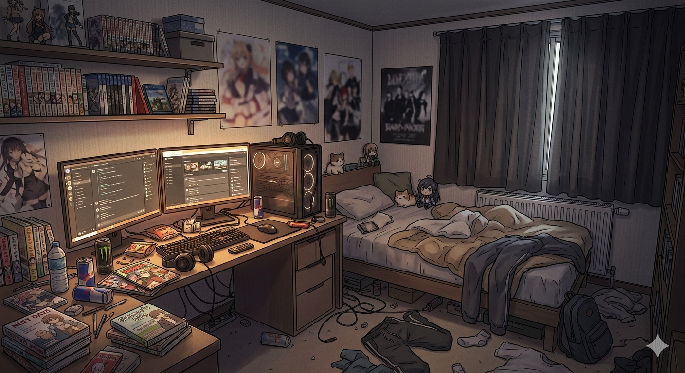

# 2. 에셋과 캐릭터의 등장

## 개요 (Overview)
글자만 나오는 검은 화면에서 벗어나, 시각적인 요소를 추가해 봅니다.

이 장에서는 이미지 에셋을 프로젝트에 등록하고,  
이를 활용해 배경을 바꾸고 캐릭터를 화면에 등장시키는 방법을 알아봅니다.  

## 사전 준비 (Prerequisites)
엔진에 기본으로 내장된 예제 이미지들을 프로젝트 내부로 복사해 사용해 보겠습니다.  
제공된 `docs/assets/` 폴더에 있는 다음 세 이미지를 여러분의 프로젝트 `assets/` 폴더에 복사해 주세요.  

| 배경 (`bg_room.png`) | 몸통 (`fumika_base_normal.png`) | 표정 (`fumika_emotion_base_normal.png`) |
| :---: | :---: | :---: |
|  |  |  |

---

## 1단계: `novel.config.ts`에 에셋과 캐릭터 등록하기

가장 먼저 엔진에게 우리가 어떤 이미지를 쓸 것인지, 캐릭터의 몸통과 얼굴은 어떻게 생겼는지 알려주어야 합니다.  
프로젝트 루트에 있는 `novel.config.ts` 파일을 열어 아래와 같이 수정합니다.  

```typescript
// novel.config.ts
import { defineNovelConfig } from 'fumika'

export default defineNovelConfig({
  width: 1280,
  height: 720,
  // 1. 사용할 이미지들의 별명(Key)과 경로를 연결합니다
  assets: {
    'bg-room': './assets/bg_room.png',
    'fumika-base': './assets/fumika_base_normal.png',
    'fumika-face': './assets/fumika_emotion_base_normal.png'
  },
  // 2. 캐릭터의 구조를 정의합니다
  characters: {
    fumika: {
      name: '후미카',
      bases: {
        // 'idle'이라는 기본 몸체에 'fumika-base' 이미지를 연결합니다
        idle: { src: 'fumika-base', width: 400, points: { face: { x: 0.5, y: 0.2 } } }
      },
      emotions: {
        // 'normal' 표정에 기본 얼굴 이미지를 연결합니다
        normal: { face: 'fumika-face' }
      }
    }
  }
})
```

### 캐릭터의 뼈대 구조

Fumika 엔진에서 캐릭터 하나를 등록할 때는 다음과 같은 계층 구조를 가집니다.  

```text
👤 캐릭터 (예: fumika)
├── 👕 몸통 (bases)
│   └── idle: 기본 교복 스탠딩 이미지 + 얼굴이 합성될 좌표(points)
└── 😊 표정 (emotions)
    └── normal: 무표정 기본 얼굴 이미지
```

### 캐릭터 구조는 왜 이렇게 복잡할까요?

이미지 한 장 대신 `bases`(몸통)와 `emotions`(표정)을 나누어 등록하는 이유는 **최적화** 때문입니다.  

표정이 바뀔 때마다 거대한 전신 이미지를 매번 불러오면 용량이 커지고 로딩이 느려집니다.  
대신 **몸통(Base) 이미지 위에 작은 얼굴(Emotion) 이미지를 얹어 교체하는 방식**을 사용하면,  
적은 메모리로도 수백 가지의 표정 변화를 빠르고 부드럽게 연출할 수 있습니다.  

> [!TIP]
> **좌표 시스템 (points)**  
> 얼굴이 합성될 위치를 지정하는 `points`는 정규화된 비율(0~1) 좌표계를 사용합니다.  
> `{ x: 0, y: 0 }`은 몸통 이미지의 **좌측 상단**이며, `{ x: 1, y: 1 }`은 **우측 하단**입니다.  
> ```typescript
> points: { face: { x: 0.5, y: 0.2 } } // 가로 중앙, 세로 상단 20% 지점에 얼굴을 합성합니다
> ```

---

## 2단계: 씬에서 배경과 캐릭터 호출하기

이제 설정한 자원들을 실제 대본에 사용할 차례입니다.  
`scenes/scene-start.ts` 파일을 열어 배경과 캐릭터를 띄우는 명령어를 추가합니다.  

```typescript
// scenes/scene-start.ts
import { defineScene } from 'fumika'
import config from '../novel.config'

export default defineScene({ config })(() => [
  // 1. 배경을 출력합니다 (config의 assets에 등록한 'bg-room' 사용)
  { type: 'background', name: 'bg-room' },

  // 2. 캐릭터를 출력합니다 ('fumika' 캐릭터의 'idle' 몸체와 'normal' 표정 사용)
  { type: 'character', action: 'show', name: 'fumika', image: 'idle:normal', position: 'center' },

  { type: 'dialogue', speaker: 'fumika', text: '안녕! 여긴 내 방이야.' }
])
```

---

## 3단계: 씬을 Config와 엔진 인스턴스에 등록하기

씬을 새로 작성하거나 수정했다면, 엔진이 이 씬의 존재를 알 수 있도록 등록해야 합니다.  
이미 1장에서 작성했다면, 아래와 같이 되어 있는지 확인해 보세요.

**1. `novel.config.ts`의 `scenes` 배열에 이름 추가하기**
타입스크립트가 씬 이름의 자동 완성을 돕도록 `novel.config.ts`에 씬 이름을 적어줍니다.
```typescript
// novel.config.ts (일부)
export default defineNovelConfig({
  width: 1280,
  height: 720,
  scenes: ['scene-start'], // 사용할 씬의 이름들을 배열로 등록합니다
  // ... 생략 ...
})
```

**2. `index.ts`의 Novel 인스턴스에 씬 매핑하기**
실제 씬 객체를 엔진에 전달합니다.
```typescript
// index.ts (일부)
import sceneStart from './scenes/scene-start'

const novel = new Novel(config, {
  element: document.getElementById('app') as HTMLElement,
  scenes: {
    'scene-start': sceneStart // 설정 파일에 적은 이름과 실제 객체를 연결합니다
  }
})
```

이제 저장하고 브라우저를 확인해 보세요!  
방 배경과 함께 후미카가 등장하여 인사를 건넬 것입니다.  

---

## 주의 사항 (Edge Cases)

* **이미지 경로 오류**  
  `assets` 객체에 적은 경로에 실제 이미지가 존재해야 합니다.  
  파일명에 오타가 없는지, 확장자(`.png`, `.jpg`)가 정확한지 확인하세요.
  
* **타입스크립트 오류 (빨간 줄)**  
  `config` 파일에 에셋이나 캐릭터를 등록하지 않고 `scene` 파일에서 먼저 이름을 적으려고 하면  
  TypeScript가 "그런 이름은 정의되어 있지 않다"며 오류를 냅니다.  
  항상 **Config 등록 -> Scene 사용** 순서를 지켜주세요.  

---

이제 그럴싸한 시각적 연출이 가능해졌습니다.  
하지만 캐릭터가 가만히 서서 말만 하는 건 조금 심심하네요.  
다음 장에서는 대사와 함께 캐릭터의 표정을 바꾸거나 애니메이션을 주는 방법을 알아보겠습니다.  

👉 **[다음 장: 3. 대사와 동적인 연출](./03-dialogue-and-actions.md)**  
