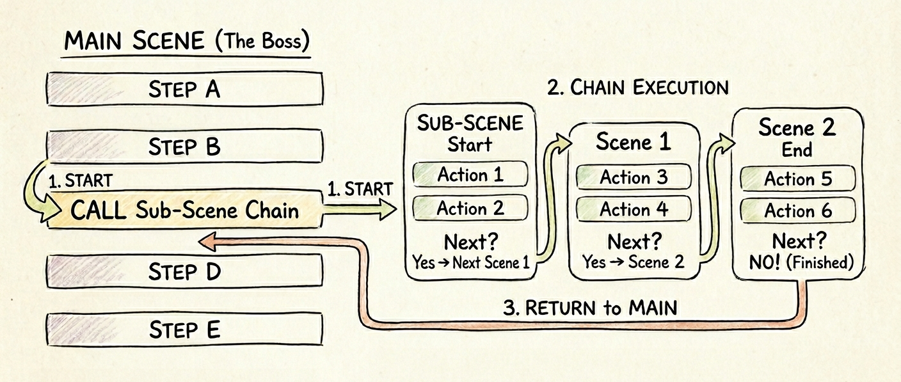

# 7. 효율적인 씬 설계: 부모-자식 구조

이 페이지에서는 하나의 씬 안에 다른 씬을 포함하는 부모-자식 구조의 구현 방법을 다룹니다.  
여러 씬에 공통으로 들어가는 요소를 한 곳에서 관리할 수 있습니다.

## 동기

프로젝트 규모가 커지면 여러 장면에 동일한 인터페이스가 반복해서 들어갑니다.  
이때 모든 씬 파일에 UI 구성 코드를 매번 작성하면 코드가 매우 길어집니다.  
나중에 UI 디자인이 변경되었을 때 관련된 모든 파일을 찾아 수정해야 하는 문제가 발생하죠.

```typescript
// ❌ 비효율적인 방식: 모든 파일에 UI 중복 작성
export default defineScene({ config })(() => [
  { type: 'element', id: 'ui-panel' }, 

  { type: 'background', name: 'bg-room' },
  { 
    type: 'dialogue', 
    text: '50번째 씬입니다. 수정하기 너무 힘들군요.' 
  }
])
```

이런 방식은 단순한 속성 하나를 변경할 때도 상당한 시간이 소요됩니다.  
코드 중복을 제거하기 위해 공통 레이어를 분리하는 방법을 살펴보겠습니다.

## 기본 사용법

먼저 공통으로 사용할 `UI` 전용 씬을 만드세요.  
이 씬이 전체 흐름을 제어하는 부모 역할을 맡게 됩니다.  
[`call`](../reserved/index.md) 명령어를 사용해 실제 스토리가 담긴 자식 씬을 호출하면 됩니다.

```typescript
// ✅ 효율적인 방식: UI 전용 부모 씬 (scenes/scene-ui.ts)
export default defineScene({ config })(({ call, label, goto }) => [
  { 
    type: 'element', 
    action: 'show', 
    id: 'ui-panel',
    kind: 'rect'
  },

  label('loop'),
  // preserve로 UI를 유지한 채 자식 씬을 호출합니다
  call('scene-start', { preserve: true, restore: true }),
  
  // 시나리오 종료 후 부모로 돌아오는 흐름이 정석입니다  
  call('scene-chapter-1', { preserve: true, restore: true }),
  
  goto('loop')
])
```

핵심은 자식 씬을 호출할 때 `preserve: true` 옵션을 켜는 것입니다.  
이 옵션이 없으면 새로운 씬으로 넘어갈 때 화면에 있는 모든 UI 요소가 삭제됩니다.  
부모 씬에서 생성한 UI를 그대로 유지하려면 반드시 포함해 주세요.

> [!WARNING]
> `preserve` 옵션 없이 다른 씬을 호출하면 현재 활성화된 화면 요소가 전부 지워집니다.  
> 화면 요소가 의도치 않게 사라진다면 이 옵션을 확인해 보세요.

## 점진적 심화

공통 UI를 부모 씬으로 분리하고 나면 자식 씬의 코드가 크게 줄어듭니다.  
자식 씬인 `scene-start.ts`의 구조가 어떻게 변했는지 확인해 볼까요.

```typescript
// scenes/scene-start.ts (자식 씬)
export default defineScene({ config })(() => [
  { type: 'background', name: 'bg-room' },
  { type: 'character', name: 'fumika', image: 'idle:normal' },
  { 
    type: 'dialogue', 
    text: '순수하게 연출에만 집중합니다.' 
  }
])
```

자식 씬 내부에는 더 이상 `element` 관련 코드가 존재하지 않습니다.  
대신 부모 씬이 실행해 둔 `ui-panel`이 화면에 계속 남아있는 상태로 텍스트가 출력되죠.  
자식 씬의 실행이 끝나면 `call` 명령어의 기본 동작에 의해 자연스럽게 부모 씬의 다음 명령어로 복귀하여 실행을 이어갑니다.

이때 `restore: true` 옵션은 자식 씬에서 변경한 화면 상태를 초기화하고, 부모 씬이 호출될 당시의 화면으로 원상 복구하는 역할을 합니다.

### 씬의 체이닝과 복귀 흐름

자식 씬 내부에서 `next` 속성을 지정하면 또 다른 씬으로 스토리를 계속 이어갈 수 있습니다.  
`next`를 따라 서브 씬들이 계속 체이닝되어 재생되다가, 더 이상 연결된 씬이 없어 종료되면 어떻게 될까요?  
놀랍게도 흐름이 끊기지 않고 자신을 처음 호출했던 상위 씬으로 똑똑하게 돌아오게 됩니다.  
아래 그림을 통해 전체적인 실행 흐름을 확인해 보세요.

  
*그림 1: 부모 씬과 자식 씬의 체이닝 및 자동 복귀 흐름도*

당신은 이러한 특성을 활용하여 거대한 스토리를 여러 개의 작은 씬 파일로 쪼개어 관리할 수 있습니다.  
스토리 재생이 끝났을 때 안전하게 부모 씬으로 복귀하도록 설계할 수 있죠.  
실제 코드에서는 다음과 같이 `defineScene`의 최상위 옵션으로 `next` 속성을 지정하여 흐름을 이어가게 됩니다.

```typescript
// scenes/scene-start.ts (자식 씬 1)
import config from '../novel.config'

export default defineScene({ 
  config,
  next: {
    scene: 'scene-chapter-1',
    preserve: true,
  } // 다음으로 이어질 씬을 지정합니다
})(() => [
  { type: 'dialogue', text: '첫 번째 씬입니다. 다음은 챕터 1로 이어집니다.' }
])

// scenes/scene-chapter-1.ts (자식 씬 2)
import config from '../novel.config'

export default defineScene({
  config,
  next: {
    scene: 'scene-chapter-2',
    preserve: true,
  }
})(() => [
  { type: 'dialogue', text: '챕터 1입니다.' }
])

// scenes/scene-chapter-2.ts (자식 씬 3 - 마지막)
import config from '../novel.config'

export default defineScene({
  config
  // next가 없으므로 실행 종료 후 상위 씬으로 자동 복귀합니다
})(() => [
  { type: 'dialogue', text: '마지막 씬입니다. 끝나면 원래 불렀던 곳으로 돌아갑니다.' }
])
```

복잡한 분기문 없이도 깔끔하게 상태를 제어할 수 있으니 적극적으로 활용해 보세요.

> [!TIP]
> 자식 씬에서 임시로 배경이나 캐릭터를 변경하는 연출이 필요할 때 `restore` 옵션이 유용합니다.  
> 부모 씬으로 복귀할 때 화면 상태가 자동으로 복구되므로 일일이 원래대로 돌려놓을 필요가 없습니다.

## 다음 단계

이제 코드의 중복을 피하면서 씬을 연결할 수 있습니다.  
다음 장에서는 장면 안에 오디오를 배치하는 방법을 다룹니다.

* **[8. 오디오 레이어링: 배경음과 효과음](./08-audio-layering.md)**
* **[명령어 참조: call](../reserved/index.md)**
