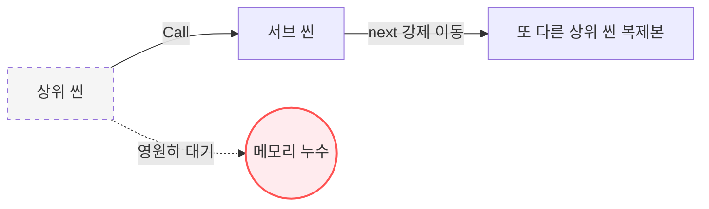
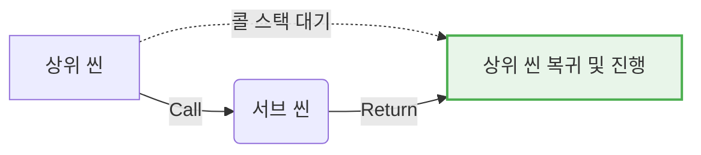
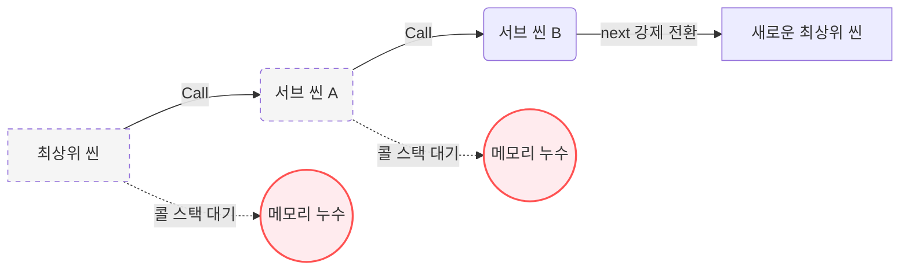
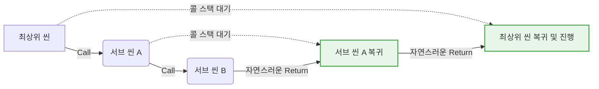

# 09. 중첩 씬 호출과 커스텀 UI (Nested Scenes) 🪆

---

## 1. 개요 (Overview)

하나의 씬 진행 도중 다른 씬을 마치 프로그래밍의 '함수'처럼 호출하고, 서브씬이 완료되면 다시 원래 씬으로 돌아오는 기능입니다. 

단순히 `next` 속성으로 씬을 이동하는 것과는 다릅니다. 이 기능은 **환경설정 창, 인벤토리, 스마트폰 화면과 같은 시스템 UI를 구현할 때 가장 유용합니다.** 그 외에도 플래시백 연출이나 공통 대화 이벤트 재사용 등에 다양하게 활용됩니다. 

## 2. 핵심 예제 (Main Example)

```ts
// 호출자 씬 (scene-start.ts)
export default defineScene({ config })([
  { type: 'dialogue', text: '잠시 스마트폰을 확인합니다.' },
  
  // 서브씬 호출. 화면과 오디오를 유지한 채 넘어가고, 복귀 시 원래 상태로 완벽히 되돌아옵니다.
  { type: 'scene', call: 'scene-sub', preserve: true, restore: true },
  
  { type: 'dialogue', text: '다시 현실로 돌아왔습니다.' }
])
```

## 3. 상태 보존 메커니즘 (State Conservation)

중첩 씬을 강력하게 만드는 것은 `preserve`와 `restore` 옵션입니다. 이 두 옵션을 통해 화면과 오디오 상태를 어떻게 이어갈지 정교하게 제어할 수 있습니다.

### 서브씬 진입 시 (`preserve`)
* **`preserve: true`**: 현재 렌더러와 오디오, 모듈 상태를 지우지 않고 **서브씬으로 그대로 가져갑니다.** 
  * **상태 유지 (State Preservation)**: 서브씬은 호출자 씬의 모듈 상태(`state`)를 고스란히 물려받습니다. 이때 **서브씬 자체에 정의된 `initial` 설정은 무시되며, 오직 물려받은 기존 상태가 이를 완전히 대체(Replace)합니다.** 기존 화면을 완벽하게 동결한 상태로 서브씬을 진행할 때 사용합니다.
* **`preserve: false`**: 완전히 백지상태(초기화)에서 서브씬을 시작합니다. 기존 화면과 오디오는 모두 지워지며 서브씬의 `initial`만 새롭게 적용됩니다.

### 서브씬 복귀 시 (`restore`)
* **`restore: true`**: 서브씬 종료 후, 호출 시점의 원래 화면과 오디오로 **완벽하게 복구합니다.**
* **`restore: false`**: 화면과 오디오는 서브씬의 마지막 상태를 그대로 이어가며, 대사 진행(커서)과 지역 변수만 복구합니다.
*(단, `preserve: false` 로 서브씬에 진입했다면 `restore` 값과 무관하게 무조건 복구 모드가 강제 작동합니다.)*

## 4. 주의 사항 (Edge Cases)

> [!WARNING]
> **서브씬에서 상위 씬(호출자)으로 직접 전환(`next`)하여 돌아가지 마세요!**
> 서브씬 내부에서 `next` 속성을 통해 자신을 호출한 상위 씬으로 강제 이동해서는 안 됩니다. 씬을 이동하더라도 쌓여 있던 콜 스택(Call Stack)은 자동으로 폐기되지 않으므로, 복귀를 기다리던 기존의 상위 씬들은 영원히 메모리 속에 갇힌 채 완전히 새로운 씬이 시작됩니다. 이 과정이 반복되면 **심각한 메모리 누수**가 발생합니다. 서브씬을 마치고 돌아갈 때는 배열이 끝나 자연스럽게 종료(Return)되도록 두어야 합니다.

#### 🚨 잘못된 단일 흐름 (메모리 누수 발생)


#### ✅ 올바른 단일 흐름 (정상 복귀)


<br>

#### 🚨 잘못된 다중 중첩 흐름 (연쇄적 메모리 누수 발생)


#### ✅ 올바른 다중 중첩 흐름 (정상적인 연쇄 복귀)


* **오디오 자동 동기화**: 서브씬 내에서 오디오를 멈추거나 변경하더라도 복구 모드(`restore: true`)라면 안심하세요. 호출 시점의 재생 시간을 기억하여 복귀 직후 해당 시간대부터 **자동으로 다시 이어 재생**됩니다.

---

[⬅️ 08. 고급 설계 가이드](./08-advanced-guide.md) | [📚 전체 문서](../README.md)
