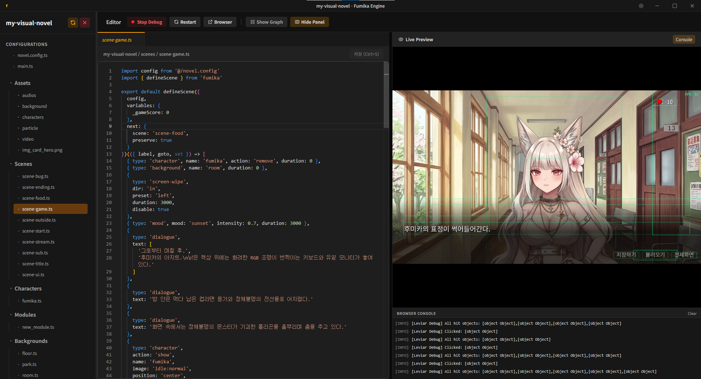
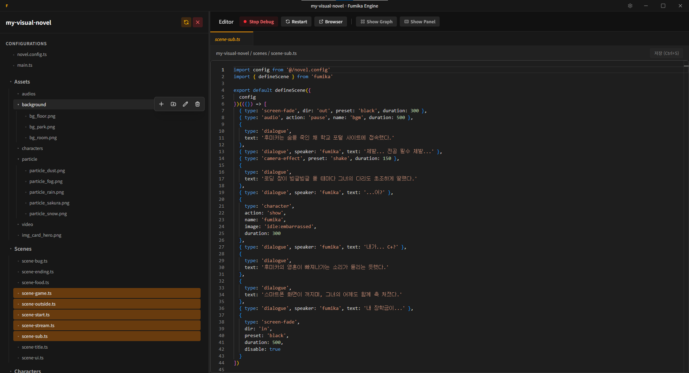

# Fumika IDE

`leviar` 비주얼 노벨 엔진을 위한 전용 통합 개발 환경(IDE)입니다.  
시각적인 씬 에디터와 실시간 렌더링 기능을 제공하여 개발 생산성을 높입니다.


## 한눈에 보는 씬의 흐름

코드가 길어지고 조건 분기가 복잡해질수록 전체 씬의 연결 구조를 파악하기 어려워집니다.  
Fumika IDE는 코드의 구조를 시각화하여 이 문제를 해결합니다.


코드의 AST(추상 구문 트리)를 분석하여 복잡한 `if-else` 분기와 씬의 이동 경로를 다이어그램으로 표시합니다. 그래프 노드를 더블클릭하면 에디터의 해당 소스 코드 위치로 즉각 이동하여 빠르게 수정할 수 있습니다.

## 실시간 렌더링과 통합 에디터



수정 사항을 확인하기 위해 새로고침을 반복할 필요가 없습니다. 좌측의 Monaco 에디터에서 코드를 작성하면, 우측 프리뷰 영역에 즉시 렌더링됩니다. TypeScript 자동 완성 기능을 활용하여 실시간으로 게임을 확인하며 개발해 보세요.

## 스마트한 프로젝트 관리



사이드바를 통해 프로젝트의 파일과 폴더를 직관적으로 관리할 수 있습니다. 파일을 생성할 때 같은 이름이 존재한다면, 덮어쓰기를 방지하기 위해 자동으로 고유한 숫자를 덧붙여줍니다. 또한, 누락된 핵심 파일을 원상 복구하는 기능을 내장하고 있습니다.

## 시작하기

루트 디렉토리에서 패키지를 설치하고 IDE를 실행하여 프로젝트를 열어 보세요.

```bash
npm install
npm run dev:ide
```

> [!WARNING]
> 누락된 파일 복구(Restore) 기능을 실행하면 필수 `declarations` 에셋 파일들을 다시 생성합니다. 사용자가 직접 수정한 기본 파일들이 덮어씌워질 수 있으므로 사용에 주의하세요.

## 라이선스

상업적 이용 및 배포와 관련된 정책은 아래 링크를 참고해 주세요.

- [Fumika 라이선스 레퍼런스 (LICENSE)](../../LICENSE)
- [IDE 아키텍처 가이드 (추가 예정)](#)
