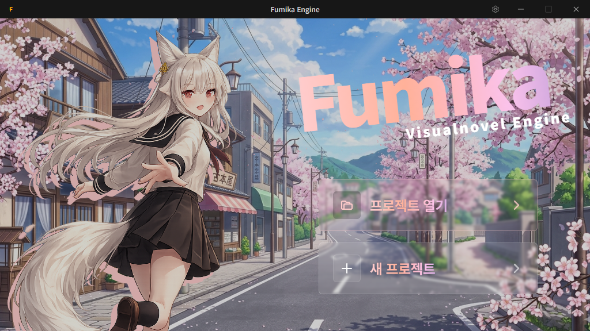

# 🌌 Fumika 생태계 (Ecosystem)

웹 환경에 최적화된 고성능 모듈형 비주얼 노벨 엔진과, 이를 완벽하게 지원하는 전용 통합 개발 환경(IDE)을 포함하는 **모노레포(Monorepo)**입니다.

## 생태계 구성

Fumika 프로젝트는 엔진 코어와 개발 도구를 분리하여 설계되었습니다. 목적에 맞게 독립적으로 사용할 수도 있고, 결합하여 강력한 시너지를 낼 수도 있습니다. 아래의 링크를 통해 각 패키지의 상세 정보를 확인해 보세요.

### 1. [Fumika Core (`packages/core`)](./packages/core/README.md)

Canvas 기반의 전용 렌더러와 독립적 캡슐화가 적용된 상태 관리 시스템을 갖춘 비주얼 노벨 엔진 코어입니다.

- **핵심 강점**: 선언적 DSL, 엄격한 TypeScript 타입 안정성 보장, 무한한 확장이 가능한 모듈형 MVC 구조.
- 순수하게 코드로 세밀한 연출을 제어하거나, 엔진의 동작 원리를 깊게 파악하고자 할 때 사용하세요.

### 2. [Fumika IDE (`packages/ide`)](./packages/ide/README.md)

`fumika` 코어 엔진 기반의 개발 생산성을 극대화하기 위해 구축된 통합 개발 환경입니다.

- **핵심 강점**: 시각적 씬 그래프 뷰어, 실시간 렌더링 프리뷰 통합, 스마트 프로젝트 파일 관리 시스템.
- 코드가 길어지고 씬의 분기가 복잡해질 때, 직관적인 시각적 도구가 필요하다면 사용하세요.

## 🚀 빠른 시작 가이드

Fumika 생태계에 어떻게 접근할지 선택해 보세요.

- **엔진 코어부터 다루고 싶다면:** [Fumika Core 시작하기](./packages/core/README.md#🚀-빠른-시작-quick-start)
- **에디터 도구로 시각적인 개발을 원한다면:** [Fumika IDE 시작하기](./packages/ide/README.md#시작하기)

> [!TIP]
> 처음 시작하시는 분들이라면, 씬의 흐름을 파악하기 쉬운 **Fumika IDE**를 통해 개발을 시작하는 것을 추천합니다.

## 라이선스

상업적 이용 및 배포와 관련된 정책은 아래 링크를 참고해 주세요.

- [Fumika 라이선스 레퍼런스 (LICENSE)](./LICENSE)
